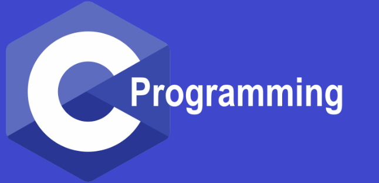

# C Programming - PS Questions

## This repository contains all the problems I solved to clear each and every level of PS in C programming.

### Feel free to go through it.

> Don't try to memorize the programs. Instead, try to understand them and solve them on your own.
> Use this as a reference and not as an answer booklet.

**Remember, there's never only one way to solve a problem. I may have used a different method than what you have in mind. So, try to solve it in your own way.**

Happy Learning!!!